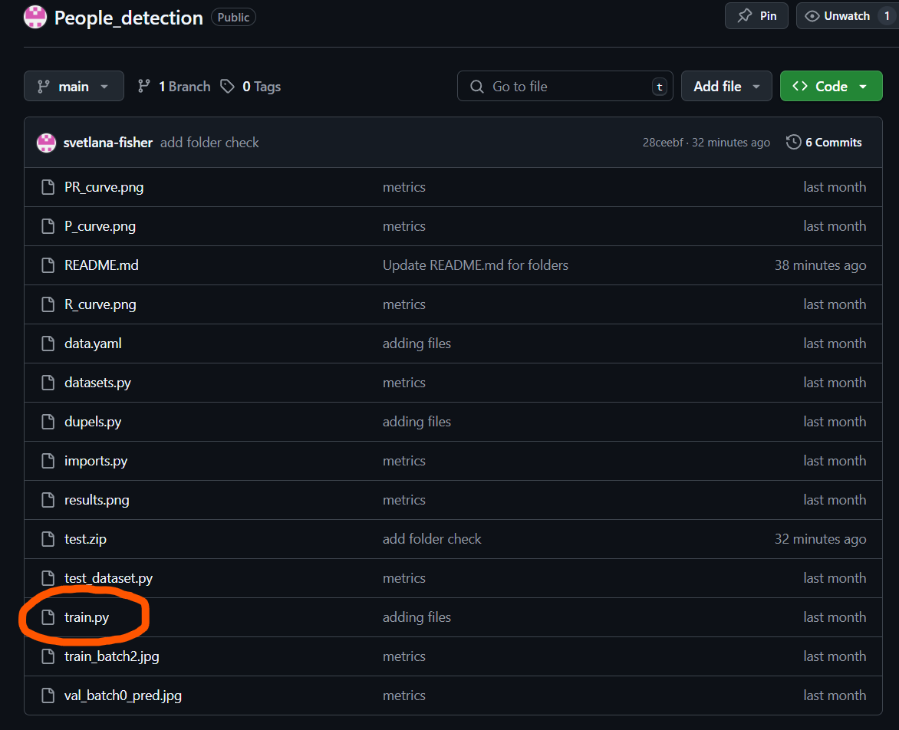
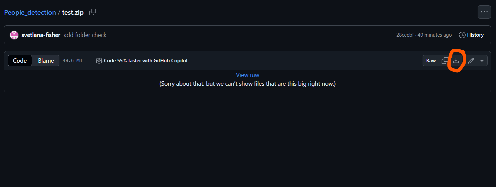

## Инструкция по запуску и использованию модели
### Скачивание необходимого архива
1. Откройте репозиторий на GitHub
2. Найдите нужный архив test.zip в списке файлов  

3. Кликните на файл, чтобы открыть его просмотр  
4. Нажмите кнопку "Download" (обычно в правом верхнем углу)  

5. После чего необходимый архив будет находиться в загрузках на вашем устройстве  
6. Рекомендуется переместить его в специально созданную папку для дальнейшего использования

### Скачивание через командную строку  
1. Откройте командную строку
2. С помощью команды cd перейдите в папку в которую вы хотите сохранить архив
3. введите следующую команду
>curl -L -O "https://github.com/username/repository/raw/branch/path/to/file.zip" 

### Распаковка скачанного архива 
Для дальнейшего использования архив необходимо распаковать, сделать это можно следующим образом  

Для windows 
1. Нажмите на test.zip правой кнопкой мыши  
2. в всплывающем окне выберите извлечь все...
3. Затем в предложенном месте укажите путь куда вы хотите извлечь содержимое архива и нажмите извлечь

также это можно сделать черех командную строку
1. Откройте командную строку
2. С помощью команды cd перейдите в папку в которую вы сохранили архив
3. введите следующую команду
>Expand-Archive -Path "C:\путь\к\test.zip" -DestinationPath "C:\папка\для\распаковки"

для Linux
1. Откройте командную строку
2. С помощью команды cd перейдите в папку в которую вы сохранили архив
3. введите следующую команду
>tar -xf test.zip -C папка_распаковки
если в вашей версии не установлена поддержка ZIP рекомендуется следующее
> sudo apt install unzip
> unzip test.zip -d папка_распаковки

Затем рекомендуется создать виртуальное окружение, в папке в которую вы распаковали содержимое архива   
для Linux
>python -m venv venv  
>source venv/bin/activate

для Windows  
>python -m venv venv  
>venv/Scripts/activate

в него необходимо установить нужные зависимости  
>pip install -r requirements.txt

Затем запустите программу start.py у неё есть передаваемые агрументы -i "input_folder_path" -o "output_folder_path" --conf "Confidence threshold"  
пример  
>python start.py -i input -o output

## Обучение

**P_curve** | **R_curve**
:-------------------------:|:-------------------------:
|  |  |

### PR_curve

### train_batch
 

### val_batch

## Итоговая map0.5
> ### 0.8726

