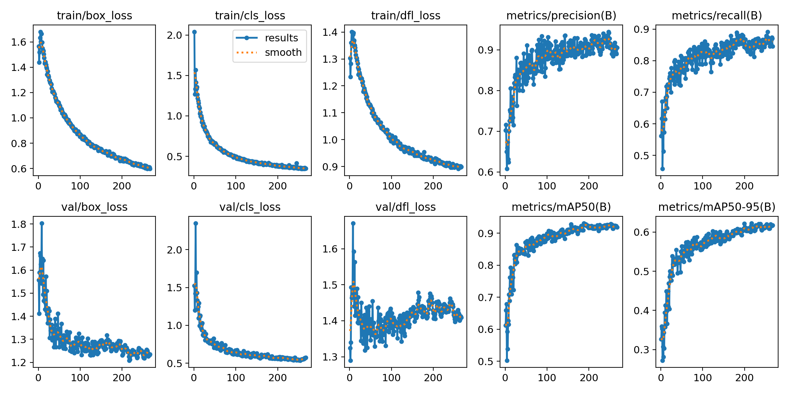
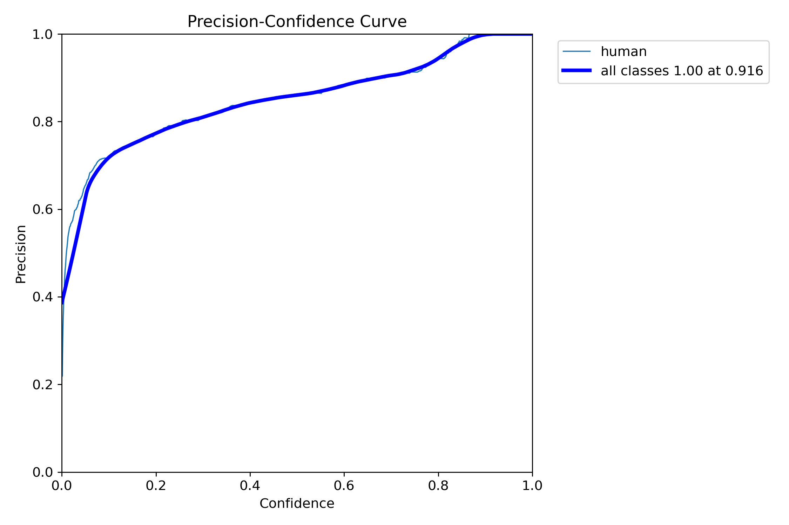
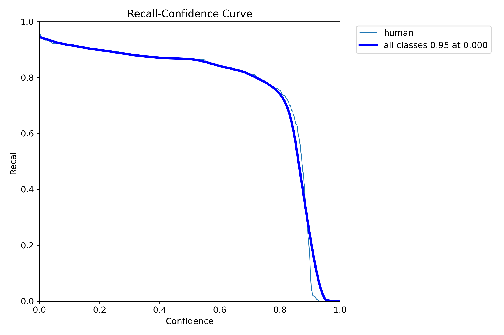
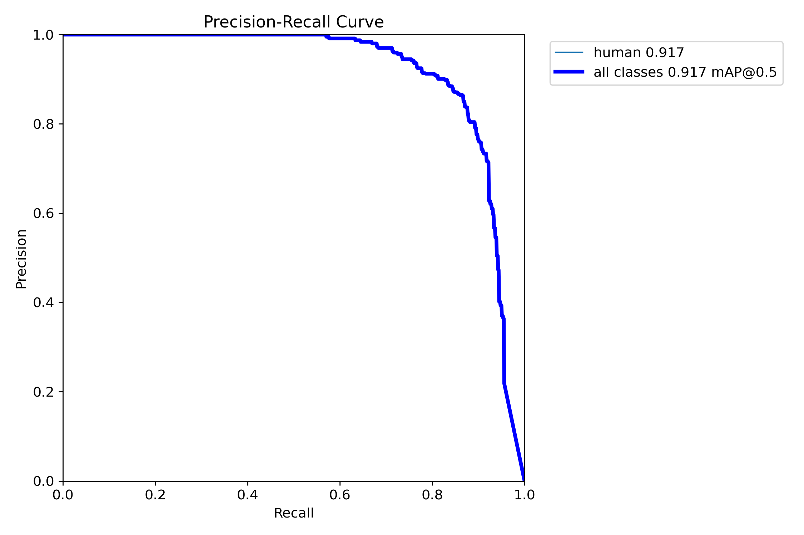
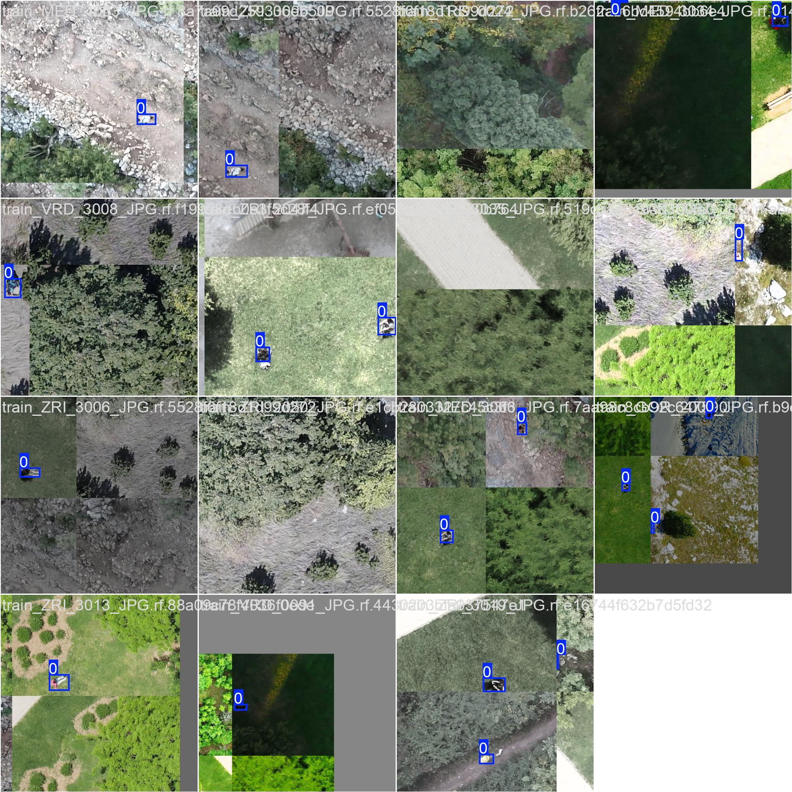
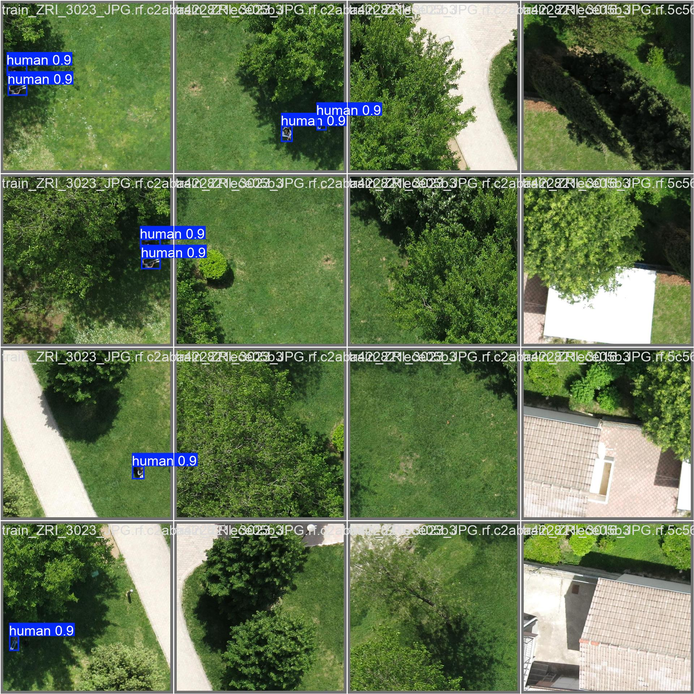

### Инструкция по запуску и использованию модели
Скачайте test.zip в нём находится всё что нужно для использования готовой модели  
распакуйте  

Затем рекомендуется создать виртуальное окружение  
для Linux
>python -m venv venv  
>source venv/bin/activate

для Windows  
>python -m venv venv  
>venv/Scripts/activate

в него необходимо установить нужные зависимости  
>pip install -r requirements.txt

Затем запустите программу start.py у неё есть передаваемые агрументы -i "input_folder_path" -o "output_folder_path" --conf "Confidence threshold"  
пример  
>python start.py -i input -o output

## Обучение

**P_curve** | **R_curve**
:-------------------------:|:-------------------------:
|  |  |

### PR_curve

### train_batch
 

### val_batch

## Итоговая map0.5
> ### 0.8726

